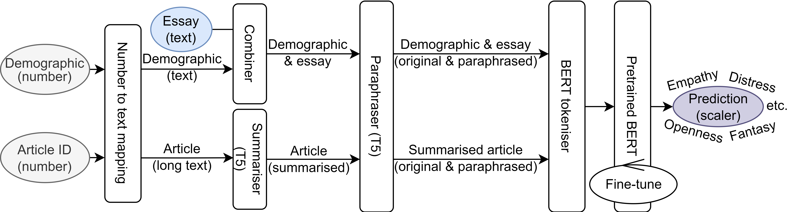

This repository contains the implementation of our paper entitled "**Curtin OCAI at WASSA 2023 Empathy, Emotion and Personality Shared Task: Demographic-Aware Prediction Using Multiple Transformers**".

## Abstract
The WASSA 2023 shared task on predicting empathy, emotion and other personality traits consists of essays, conversations and articles in textual form and participants' demographic information in numerical form. To address the tasks, our contributions include (1) converting numerical information into meaningful text information using appropriate templates, (2) summarising lengthy articles, and (3) augmenting training data by paraphrasing. To achieve these contributions, we leveraged two separate T5-based pre-trained transformers. We then fine-tuned pre-trained BERT, DistilBERT and ALBERT for predicting empathy and personality traits. We used the Optuna hyperparameter optimisation framework to fine-tune learning rates, batch sizes and weight initialisation. Our proposed system achieved its highest performance – a Pearson correlation coefficient of 0.750 – on the conversation-level empathy prediction task.

## Overall architecture of the system

## Useful file descriptions
- `combine_data.ipynb`: For essay-level tasks, combine (1) dev set with corresponding labels and (2) train set and dev set
- `preprocessing.ipynb`: For essay-level-tasks, convert initial pre-processing, such as removing missing values and converting numerical demographic and personal information to textual data. In addition, summarising and paraphrasing texts.
- `preprocessing_CONV.ipynb`: Data combine and preprocessing for CONV task
- `main_methods.py`: Methods written for training and testing for any essay-level tasks, such as empathy, distress, etc.
- `hyperparam_tuner.py`: Methods written for optuna hyperparam tuner.
- `main_<task>`: Notebook from where I call the methods to make predictions as well as hyperparameter tuning on essay-level tasks. For CONV task, no separate py files are used as method and tuner since it's not required for any other tasks.
- `requirements.txt`: Major software packagase with corresponding versions
- `evaluation.py`: The evaluation file provided by WASSA 2023. It consists of methods to evaluate the performance, such as Pearson correlation coefficient.
 
## How to run
- Create directories if not already exist (`dataset/` is optional if you use `processed_data`)
	- `dataset/`
		- `dataset/dev/`
		- `dataset/test/`
	- `processed_data/`
	- `prediction/`
	- `tmp/`
- Download the dataset from [the official WASSA 2023 competition site at CodaLab](https://codalab.lisn.upsaclay.fr/competitions/11167) (optional if you use `processed_data`)
	- Keep training datasets and `article_adobe_AMT.csv` in `dataset/`folder
	- Keep dev sets at `dataset/dev/` folder
	- Keep test sets at `dataset/test/` folder
- Essay-level tasks
	- `combine_data.ipynb` (optional if you use `processed_data`)
	- `preprocessing.ipynb` (optional if you use `processed_data`)
	- `main_<task>.ipynb`
- Conversation-level tasks
	- `preprocessing_CONV.ipynb` (optional if you use `processed_data`)
	- `main_CONV.ipynb`
